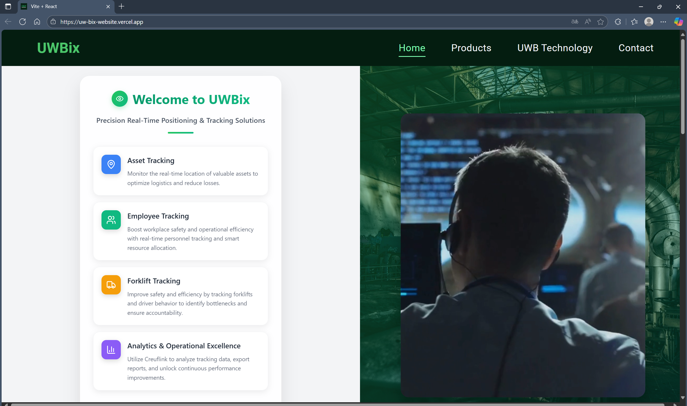
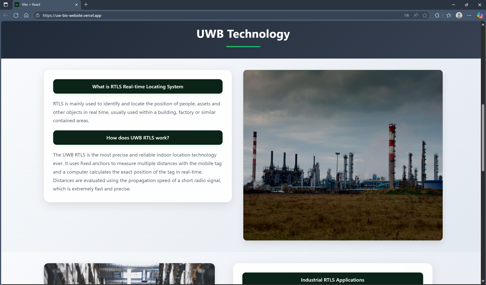
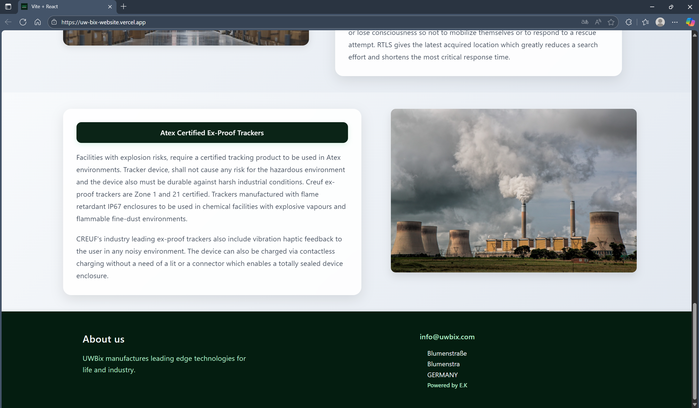
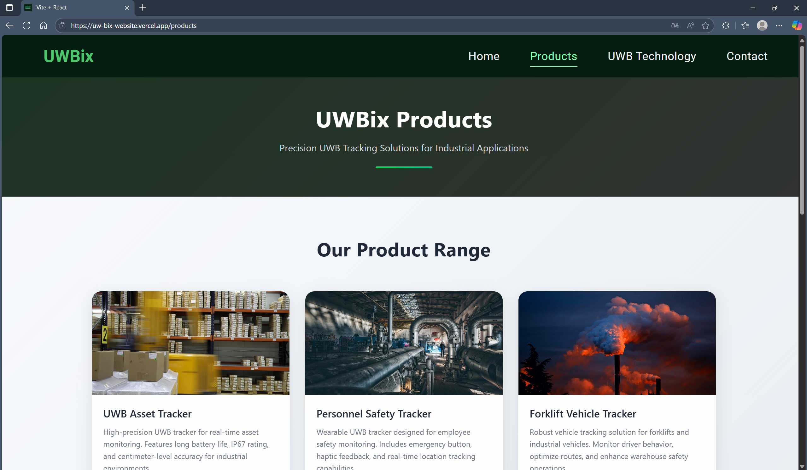
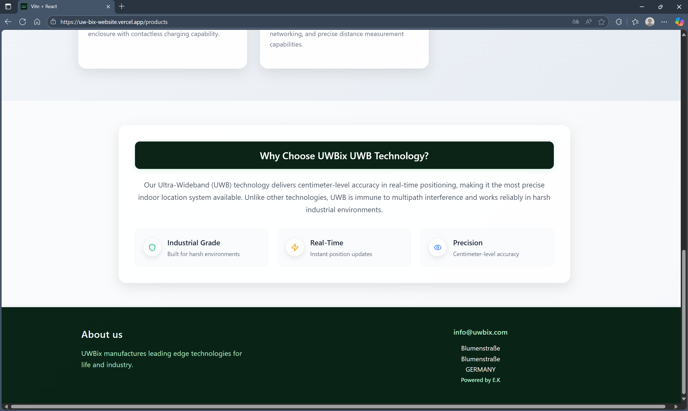
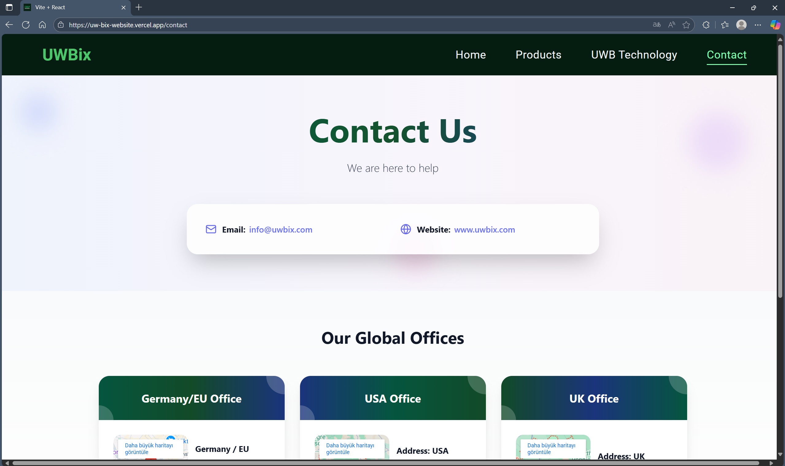
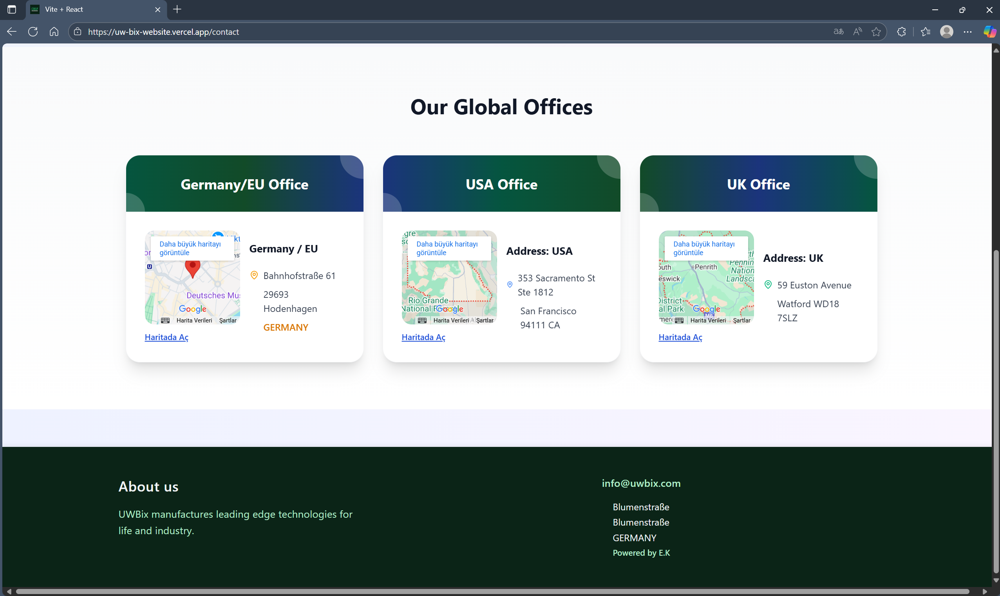

# UWBix Web Sitesi

## Projeye Genel Bakış

Endüstriyel alanda ürün tasarımı ve üretimi yapan bir şirket için React ile tasarlanmış statik bir web sitesidir.

## Kullanılan Teknolojiler

### Front-end Framework

- React: UI geliştirme için modern JS kütüphanesi

### Stil ve Tasarım

- CSS-in-JS
- CSS3 Animasyonları: keyframe animasyonları ve geçiş efektleri
- Glassmorphism Tasarım: Backdrop filtreleme
- Responsive Tasarım: CSS Grid ve Flexbox düzeni

### İkonlar ve Görseller

- Lucide React: ikonlar

## Fotoğraflar

### Home Page

### Products

### Contact Us

